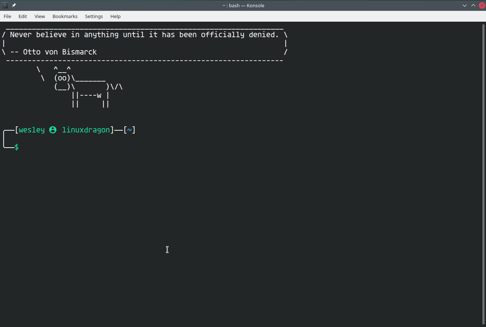

Welcome to Bash Facilities
==========================

**Hi! This is "bash_facilities"**, a set of scripts to 
give you a better management of your bash config and 
init files. You also will have a nice and useful prompt:

Now it is easier to locate and change
your functions, aliases and configs.

Bash is your friend, go ahead and make it your way!

Requisites
----------

If you have any problems, try installing the following dependencies:

`sudo apt-get install curl git bash-completion rbenv fortune-mod cowsay`

If your environment was installed by the Ansible Playbook
in https://github.com/wesleyit/debian_workstation_devops then you
should already have those packages.

Install
-------

To install, open your terminal (using bash, it will not work on zsh or oh-my-zsh).
Type:

`curl https://raw.githubusercontent.com/wesleyit/bash_facilities/master/installer.sh | bash`

Then, exit the terminal and open it again. It is done!
